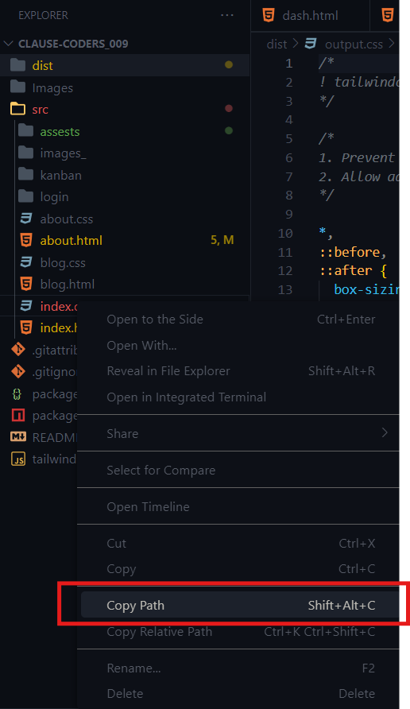

## Task Management Tool UI

## Introduction
TaskMentor is a task management tool designed to streamline task creation, assignment, and tracking. The project focuses on providing an intuitive user interface for managing tasks through different views, including list, Kanban, and calendar formats. The primary goal is to enhance productivity by making task management simple and efficient.

## Project Type
Frontend

## Deployed App
Frontend: https://deployed-site.whatever

## Directory Structure
Clause Coders_009/
├─ dist/
├─ src/
│  ├─ kanban/
│  ├─ login/
│  ├─ about.css
│  ├─ about.html
│  ├─ blog.css
│  ├─ blog.html
│  ├─ index.css
│  ├─ index.html
├─ .gitattributes
├─ .gitignore
├─ package-lock.json
├─ package.json
├─ README.md
├─ tailwind.config.js

## Video Walkthrough of the Project
Attach a very short video walkthrough of all of the features (1 - 3 minutes).

## Video Walkthrough of the Codebase
Attach a very short video walkthrough of the codebase (1 - 5 minutes).

## Features
1. Task creation and assignment
2. List view for tasks
3. Kanban view for tasks
4. Calendar view for tasks
5. Design Decisions or Assumptions

## List your design decisions and assumptions:
Focused on HTML, CSS, and Tailwind CSS for a responsive and visually appealing interface.
Assumed users would need multiple views (list, Kanban, calendar) for flexible task management.
Prioritized simplicity and ease of use in the user interface design.

## Installation & Getting Started
No installation is necessary. To check the deployed link, visit https://deployed-site.whatever or open index.html inside the source directory.

## Usage
To use TaskMentor, follow these steps:
1. Access the Application
    Open the Deployed Site: Visit https://deployed-site.whatever to access TaskMentor.
    Task Creation and Assignment

2. Create a Task:
    Click on the "Add Task" button.
    Fill in the task details, such as title, description, due date, priority, and assignee.
    Click "Save" to add the task.

3. Assign a Task:
    Select a task from the list.
    Choose an assignee from the dropdown menu.
    Click "Assign" to save the changes.

4. Task Views
    1. List View:
        Navigate to the "List View" tab.
        View all tasks in a list format.
        Use the sort and filter options to organize tasks by due date, priority, or assignee.

5. Kanban View:
    Navigate to the "Kanban View" tab.
    View tasks in a Kanban board format with columns for different stages (e.g., To Do, In Progress, Done).
    Drag and drop tasks between columns to update their status.

6. Calendar View:
    Navigate to the "Calendar View" tab.
    View tasks on a calendar based on their due dates.
    Integration with Google Calendar
    
## Example Usage
1. Adding a Task:
    Click "Add Task".
    Enter the task title: "Design Homepage".
    Enter the description: "Create a responsive homepage design".
    Assign the task to "John Doe".
    Click "create".

2. Viewing Tasks in Kanban View:
    Navigate to the "Kanban View".
    
3. View Tasks with Google Calendar

## screenshots of the application in different views:
Homepage:
List View:.png)
Kanban View:.png)
Calendar View:
Create new issue:.png)

## bash
# Open index.html in a browser

## Credentials
No Credentials needed

## APIs Used
The application uses Google Calendar integration to manage and synchronize tasks with users' Google Calendar.

## Technology Stack
HTML
CSS
Tailwind CSS

## Minimum Expected Features:
1. Homepage:
    Introduction to the task management tool and its features.
    Overview of the different views available.

2. Task Creation and Assignment:
    Interface to create new tasks with details such as title, description, due date, priority, and assignee.
    Ability to assign tasks to different users.

3. List View:
    Display tasks in a list format.
    Options to sort and filter tasks based on different criteria (e.g., due date, priority, assignee).

4. Kanban View:
    Display tasks in a Kanban board format with columns for different stages (e.g., To Do, In Progress, Done).

5. Calendar View:
    Display tasks on a calendar based on their due dates.

## Responsive Design using HTML, CSS, and Tailwind CSS.